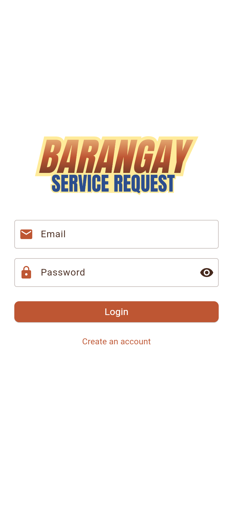
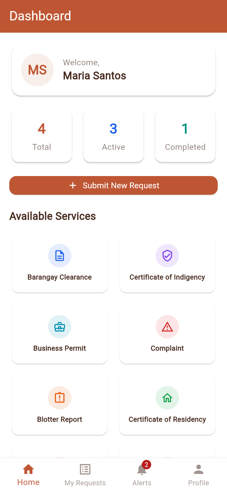
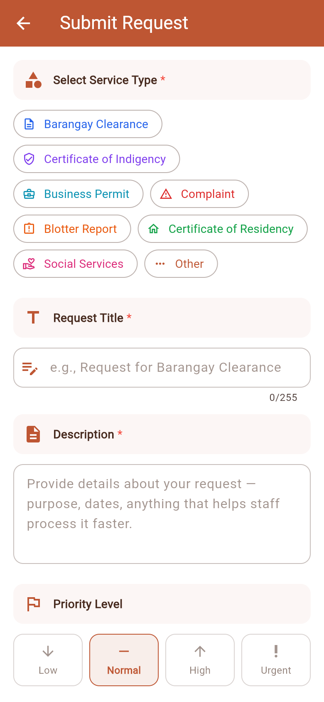
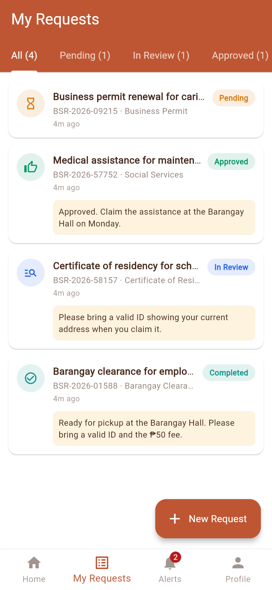
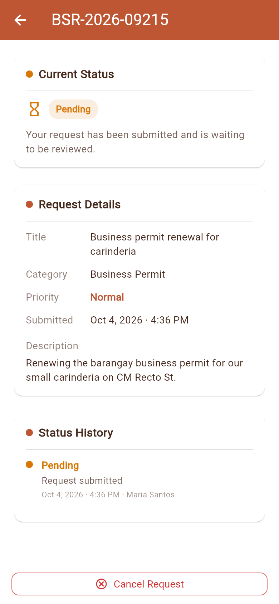
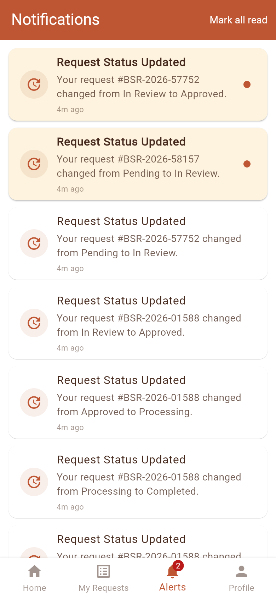
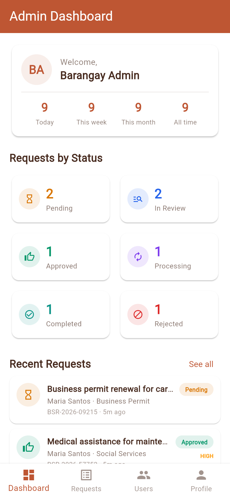
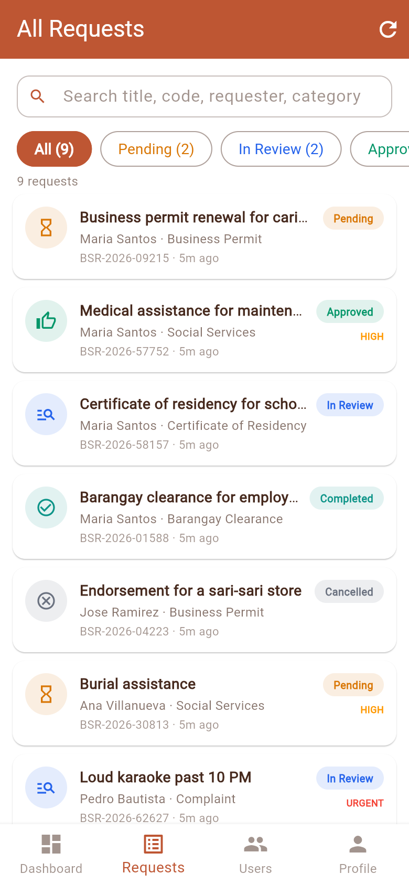
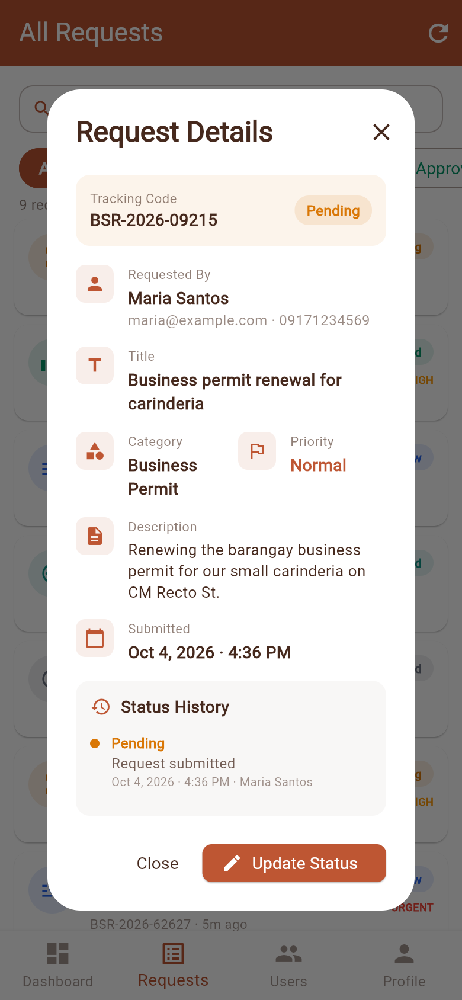
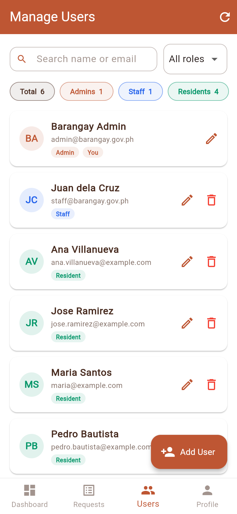

<p align="center">
  
</p>

<p align="center">
  
  
  
  
</p>

<p align="center">
  <a href="#quick-setup"><strong>Quick Setup</strong></a> ·
  <a href="#screenshots">Screenshots</a> ·
  <a href="https://github.com/nncast/laravel-barangay-service-request-api">API Backend</a> ·
  <a href="AUTHORS.md">Authors</a>
</p>

**Barangay Service System** is a Flutter mobile app for **Barangay Dubinan East**. Residents submit service requests (clearances, certificates, permits, complaints, blotter reports) and track them from submission to completion. Barangay staff and admins review requests, update their status with remarks, and manage user accounts.

The app talks to the [Laravel API backend](https://github.com/nncast/laravel-barangay-service-request-api), which must be running for the app to work.

## Screenshots

**Residents**

<p align="center">
  
  
  
  
  
  
</p>

**Staff and admins**

<p align="center">
  
  
  
  
</p>

## Features

**Residents**
- Register and log in
- Submit a request: pick a service, add a title, description and priority
- Track each request through **Pending → In Review → Approved → Processing → Completed** (or Rejected), with staff remarks and a dated status history
- Cancel a request while it is still pending
- Notifications whenever staff update a request; tap one to open the request

**Staff and admins**
- Dashboard with counts for every status, plus today / this week / this month
- All requests with search and status filters
- Update a request's status and leave remarks for the resident
- View users (staff) or add, edit, deactivate and delete users (admin)

## Roles

| Feature | Resident | Staff | Admin |
| --- | :---: | :---: | :---: |
| Submit, track and cancel own requests | ✓ | | |
| Notifications | ✓ | | |
| View all requests, update status | | ✓ | ✓ |
| Dashboard statistics | | ✓ | ✓ |
| View users | | ✓ | ✓ |
| Add, edit, deactivate and delete users | | | ✓ |

## Tech Stack

| Category | Details |
| --- | --- |
| Framework | Flutter 3.24 or later (Dart 3.5+) |
| State management | Provider |
| Networking | `http`, token auth (Laravel Sanctum) |
| Local storage | `shared_preferences` (session token) |
| Other packages | `url_launcher`, `intl` |
| Platforms | Android, Windows, web (iOS and macOS untested) |

## Quick Setup

### 1. Prerequisites

| Tool | Download |
| --- | --- |
| Flutter SDK 3.24 or later | [flutter.dev](https://docs.flutter.dev/get-started/install) |
| Android Studio or VS Code | [Android Studio](https://developer.android.com/studio) · [VS Code](https://code.visualstudio.com/) |
| The API backend, running | [laravel-barangay-service-request-api](https://github.com/nncast/laravel-barangay-service-request-api#quick-setup) |

Set up and start the API first (`php artisan serve`). You should see:

```
INFO  Server running on [http://127.0.0.1:8000].
```

### 2. Clone the repository

```bash
git clone https://github.com/nncast/flutter-barangay-service-request-app.git
cd flutter-barangay-service-request-app
```

### 3. Get dependencies

```bash
flutter pub get
```

### 4. Run the app

The app picks the API address for you:

| Where the app runs | API address used |
| --- | --- |
| Android emulator | `http://10.0.2.2:8000/api` (the emulator's alias for your computer) |
| Windows, macOS, Linux, web | `http://localhost:8000/api` |

```bash
flutter run
```

**On a physical phone**, the phone must reach your computer over Wi-Fi. Find your computer's IP address (`ipconfig` on Windows), start the API so it listens on the network, and pass that address to the app:

```bash
# in the API folder
php artisan serve --host=0.0.0.0 --port=8000

# in the app folder
flutter run --dart-define=API_BASE_URL=http://192.168.1.100:8000/api
```

Use the same `--dart-define` with `flutter build apk` to build an APK that connects to your server.

## Demo Accounts

These are created by the API's seeder (`php artisan migrate --seed`).

| Role | Email | Password |
|------|-------|----------|
| Admin | admin@barangay.gov.ph | Admin1234 |
| Staff | staff@barangay.gov.ph | Staff1234 |
| Resident | maria@example.com | User1234 |

New residents can also register from the app (passwords need at least 8 characters).

## Project Structure

```
lib/
├── core/
│   ├── api_service.dart        API base URL, HTTP helpers, error messages
│   ├── models.dart             User, category, request, status log, notification, dashboard
│   ├── session.dart            Login routing, logout, snackbars
│   └── ui_helpers.dart         Brand colors, status labels/colors/icons, date formatting
├── providers/
│   ├── auth_provider.dart      Login, registration, session restore
│   ├── request_provider.dart   Requests, categories, notifications, dashboard
│   └── user_provider.dart      User management (admin)
├── screens/
│   ├── auth/                   Login, register
│   ├── home/                   Resident dashboard and tabs
│   ├── requests/               My requests, request details, submit request
│   ├── notifications/          Resident notifications
│   ├── profile/                Profile, help, about
│   └── admin/                  Staff/admin dashboard, all requests, users
└── main.dart                   App theme, routes, splash screen
```

## Running tests

```bash
flutter analyze
flutter test
```

## Common Issues

**"Unable to connect to the server"**
- Make sure the API is running: `php artisan serve` in the API folder.
- On a physical phone, use `--dart-define=API_BASE_URL=...` with your computer's IP and start the API with `--host=0.0.0.0` (see [Run the app](#4-run-the-app)). The phone and computer must be on the same Wi-Fi.
- Windows Firewall may block port 8000 the first time; allow PHP through when prompted.

**"This account has been deactivated"**
An admin turned the account off. Ask an admin to reactivate it from **Users → Edit → Active**.

**Build errors**
```bash
flutter clean
flutter pub get
flutter run
```

**Emulator not showing**
```bash
flutter emulators
flutter emulators --launch <emulator_id>
```

## Contributing

Contributions are welcome. Fork the repository, work on a branch from `main`, and open a pull request describing what changed and why. See [CONTRIBUTING.md](CONTRIBUTING.md) for the workflow and code style, and [AUTHORS.md](AUTHORS.md) for the people who built it.

## Security

Please don't report vulnerabilities in public issues. Use the repository's **Security → Report a vulnerability** tab instead. See [SECURITY.md](SECURITY.md) for details.

## Repository

- Flutter App: [flutter-barangay-service-request-app](https://github.com/nncast/flutter-barangay-service-request-app)
- API Backend: [laravel-barangay-service-request-api](https://github.com/nncast/laravel-barangay-service-request-api)

---

*Barangay Service System · Flutter · Provider · Laravel API*
